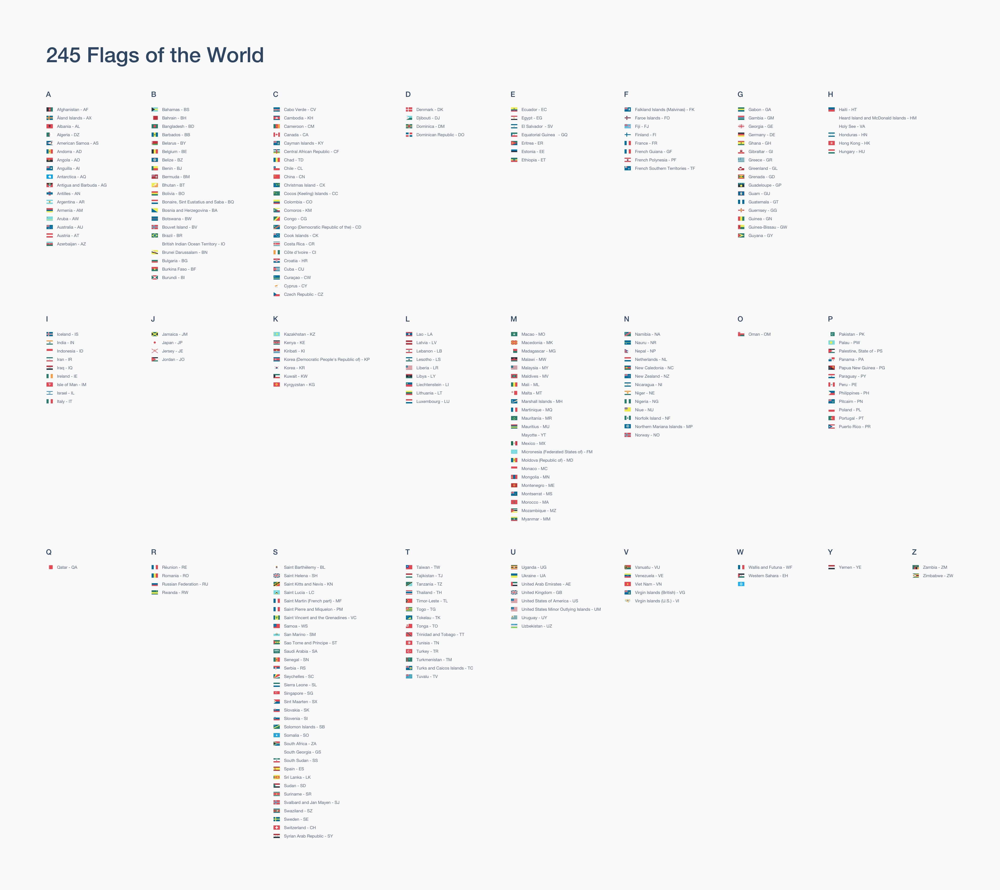

245 flags Free for you to use and enjoy. These flags have been super simplified (as much as possible) to keep the SVG file sizes small. Complex crests and textures have been re-created using simple paths (some of which could do with some improving).

- All vector, all in sketch
- Most colors stored as easily maintainable sketch styles (todo: this needs some cleanup)
- Available to use immediately as PNG (1-3x), SVG and PDF.
- SVGs have been [optimised](https://github.com/svg/svgo) and PNGs have been crushed.

## Preview

Contributions and improvements are most welcome.

##Credits

Josh Djuric
jdjuric@worldremit.com

Elliot Roberts
ehroberts@worldremit.com
